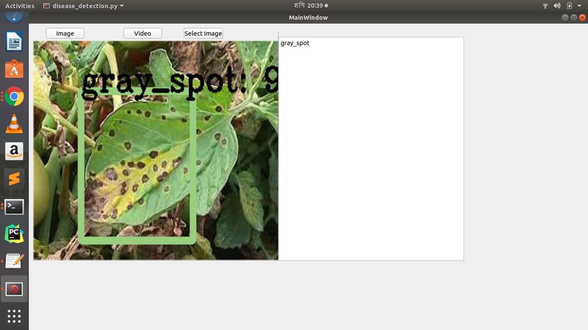

## Intro
Tomato diseses detection using YOLO v2. python implementation of darknet version of yolo.
Can detect Late blight, bacterial canker, Gray spot ,and healthy plant.

  

Demo Video
https://youtu.be/j-Re4bfkyZ8

## Dependencies

Python3, tensorflow 1.0, numpy, opencv 3,pyqt5

$ pip3 install opencv-contrib-python
$ pip3 install tensorflow
$ pip3 install numpy
$ pip3 install 
$ sudo apt-get install python3-pyqt5  # for pyqt5

### Getting started

You can choose _one_ of the following three ways to get started with darkflow.

1.  git clone https://github.com/shuntos/Tomato-diseases-Detection-.git
2.  cd Tomato-diseases-Detection
3.  python3 setup.py build_ext --inplace
   

